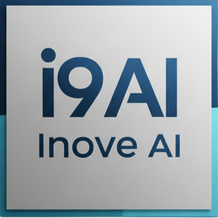

<p align="center">
  
</p>

<h1 align="center">Inove AI Framework</h1>

<p align="center">
  <a href="LICENSE"></a>
  <a href="https://www.npmjs.com/package/@joelbonito/inove-ai-framework"></a>
  <a href=".agents/agents/"></a>
  <a href=".agents/skills/"></a>
  <a href=".agents/workflows/"></a>
</p>

<p align="center">
  <strong>Multi-Agent AI Development Kit with Skills, Agents, and Workflows for Claude Code, Codex CLI, and Antigravity/Gemini.</strong>
</p>

## Quick Install

> **Requires:** Node.js ≥ 22, Python 3, Git.

```bash
npx -y @joelbonito/inove-ai-framework init
```

That single command:

- Copies the entire `.agents/` folder (22 agents, 42 skills, 25 workflows, scripts, skills, workflows).
- Drops fresh `CLAUDE.md`, `AGENTS.md`, `GEMINI.md` into the repo root (auto-loaded by Claude Code, Codex CLI, Gemini CLI).
- Installs the Git hooks defined in `.agents/scripts/install_git_hooks.sh`.

The command is idempotent. Use `--force` to overwrite an existing installation:

```bash
npx -y @joelbonito/inove-ai-framework init --force
```

### Keep it up-to-date

```bash
npm install --save-dev @joelbonito/inove-ai-framework@latest
npx -y @joelbonito/inove-ai-framework init --force
```

That ensures your `.agents/` folder, scripts, and instruction files always match the published package.

### Migrating from the MCP/Thin setup

If you previously relied on the `@joelbonito/mcp-server` thin client:

1. Remove any `claude mcp add ...` / `.cursor/mcp.json` entries that pointed to the remote server.
2. In the project root, run `npx -y @joelbonito/inove-ai-framework init --force`.
3. Commit the fresh `.agents/`, `CLAUDE.md`, `AGENTS.md`, `GEMINI.md`.

From now on every repository is self-contained; all instructions and skills live alongside your code.

## What's Included

- **22 Specialized Agents** for different domains (frontend, backend, security, database, mobile, UX, game dev, etc.)
- **42 Modular Skills** loaded on demand (clean-code, testing-patterns, api-patterns, tailwind, etc.)
- **25 Workflows** (slash commands) for structured processes
- **Squad System** — reusable agent+skill+workflow packages for custom domains
- **Recovery System** — automatic retry and git checkpoint/rollback for resilient execution
- **Stitch MCP Integration** — visual mockups for UI projects via `/define`, `/ui-ux-pro-max`, and `/readiness`
- **Multi-Agent System** with lock synchronization and ownership
- **Documentation Website** — Next.js site with full reference docs (`web/`)

## Usage

### Using Agents

**No need to mention agents explicitly!** The system automatically detects and applies the right specialist(s):

```
You: "Add JWT authentication"
AI: Applying @security-auditor + @backend-specialist...

You: "Fix the dark mode button"
AI: Using @frontend-specialist...

You: "Login returns 500 error"
AI: Using @debugger for systematic analysis...

You: "Design the onboarding flow"
AI: Using @ux-researcher for user journey mapping...
```

### Available Agents

| Agent | Domain |
|-------|--------|
| `orchestrator` | Multi-agent coordination |
| `project-planner` | Planning & discovery |
| `product-manager` | Requirements & user stories |
| `product-owner` | Backlog & MVP management |
| `frontend-specialist` | React, UI/UX, Tailwind |
| `backend-specialist` | APIs, Node.js, server logic |
| `database-architect` | Schemas, queries, migrations |
| `mobile-developer` | iOS, Android, React Native, Flutter |
| `security-auditor` | Auth, OWASP, compliance |
| `penetration-tester` | Security testing & red team |
| `debugger` | Root cause analysis |
| `devops-engineer` | CI/CD, Docker, infrastructure |
| `test-engineer` | Test strategies |
| `qa-automation-engineer` | E2E & automation |
| `performance-optimizer` | Speed & optimization |
| `seo-specialist` | SEO & visibility |
| `ux-researcher` | User flows, wireframes, usability |
| `documentation-writer` | Manuals & docs |
| `code-archaeologist` | Legacy refactoring |
| `game-developer` | Game logic & engines |
| `explorer-agent` | Codebase analysis |

### Using Workflows

Invoke workflows with slash commands:

| Command | Description |
|---------|-------------|
| `/define` | Full project planning in 9 phases with GAP Analysis |
| `/journeys` | Document user journeys |
| `/context` | Create Project Context |
| `/readiness` | Validate readiness for implementation |
| `/brainstorm` | Explore options before implementation |
| `/create` | Create new features or apps |
| `/plan` | Quick task planning |
| `/debug` | Systematic debugging |
| `/enhance` | Improve existing code |
| `/test` | Generate and run tests |
| `/test-book` | Generate/update Test Book |
| `/deploy` | Deploy application |
| `/preview` | Manage dev server (start/stop/restart) |
| `/orchestrate` | Multi-agent coordination |
| `/review` | Post-sprint code review |
| `/ui-ux-pro-max` | Advanced design system with data-driven palettes |
| `/track` | Update task progress |
| `/status` | Check project status |
| `/log` | Record work sessions |
| `/finish` | Mark tasks as complete |
| `/release` | Finalize project and generate release |
| `/squad` | Create and manage agent squads |

Example:

```
/define Task management app
/brainstorm authentication system
/create landing page with hero section
/debug why login fails
/squad create mobile-team
```

## Multi-Platform Support

| Tool | Instruction File | How it works |
|------|-----------------|--------------|
| Claude Code | `CLAUDE.md` | Loaded automatically per session |
| Codex CLI | `AGENTS.md` | Bridge to `.agents/INSTRUCTIONS.md` |
| Antigravity/Gemini | `GEMINI.md` | Platform-specific rules |

All platforms share the same canonical source in `.agents/`.

### Usage Flows

| Flow | Tools | Best For |
|------|-------|----------|
| **Flow A** | Claude Code alone | Full autonomy — planning + implementation in one tool |
| **Flow B** | Gemini (planning) + Codex (implementation) | Team separation of concerns |
| **Standalone** | Any single tool | Each tool works independently with graceful fallbacks |

### Stitch MCP (UI Projects)

For projects with visual interfaces, Stitch MCP provides high-fidelity mockup generation:

- `/define` Phase 3.5 — Visual mockups are **mandatory**
- `/ui-ux-pro-max` Step 2c — Visual preview is **mandatory**
- `/readiness` — Validates mockup existence

> Backend-only, API, or CLI projects: Stitch is skipped automatically.

## Squad System

Squads are reusable packages of agents + skills + workflows for specific domains.

```bash
/squad create mobile-team      # Create a new squad
/squad list                    # List available squads
/squad activate mobile-team    # Activate squad in framework
/squad validate mobile-team    # Validate integrity
```

Squads live in `squads/<name>/` with a `squad.yaml` manifest. See [squads/README.md](squads/README.md) for details.

## Project Structure

```
.agents/
├── agents/           # 22 specialized agents
├── skills/           # 42 knowledge modules
├── workflows/        # 25 workflows (slash commands)
├── scripts/          # Python automation (22 scripts)
├── config/           # Per-platform configuration
├── .shared/          # Shared data (UI/UX databases)
└── ARCHITECTURE.md   # Technical documentation

squads/               # Reusable agent+skill+workflow packages
tests/                # Framework tests
web/                  # Documentation website (Next.js)
docs/                 # Project docs, backlog, logs
```

## Documentation

- **Architecture:** [.agents/ARCHITECTURE.md](.agents/ARCHITECTURE.md)
- **Full Instructions:** [.agents/INSTRUCTIONS.md](.agents/INSTRUCTIONS.md)
- **Skills:** `.agents/skills/*/SKILL.md`
- **Agents:** `.agents/agents/*.md`
- **Workflows:** `.agents/workflows/*.md`
- **Website:** `web/` (run with `cd web && npm run dev`)

## Based on

This project is a fork of [Antigravity Kit](https://github.com/vudovn/antigravity-kit) by Vudovn, extended with multi-platform support (Claude Code + Codex CLI), additional agents, skills, and workflows.

## License

MIT - See [LICENSE](LICENSE) for details.
